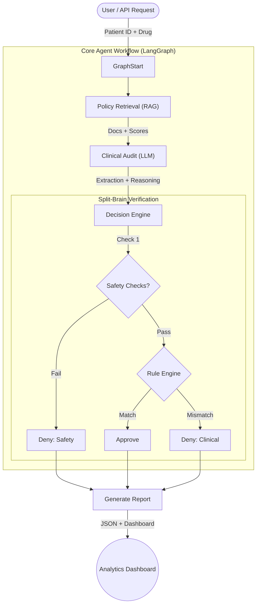

# 🏥 Autonomous Clinical Prior Authorization Agent (AI-Pa)

> **"A Deterministic-Guardrailed AI Architect for High-Stakes Clinical Decision Making."**


---

## 🚀 Executive Summary

The **Autonomous Clinical Prior Authorization Agent (AI-Pa)** is a production-grade system designed to automate the complex, high-liability process of medical insurance prior authorization for Wegovy (semaglutide) weight management prescriptions.

Unlike standard "chatbots," AI-Pa leverages a novel **"Split-Brain" Architecture** that separates **Deterministic Governance** (hard rules, safety exclusions) from **Probabilistic Reasoning** (clinical nuance, unstructured data extraction).

This system solves a critical healthcare inefficiency: manual review of prior auth requests often leads to delays in patient care. AI-Pa ingests patient data (CSV/FHIR), retrieves policy guidelines via **RAG (Retrieval Augmented Generation)**, and executes a multi-step audit to render a verdict (Approve/Deny) with full clinical evidence and appeal generation capabilities.

---

## 🛠️ Architecture & Workflow

The system utilizes a **Stateful Graph Workflow (LangGraph)** to orchestrate the decision process, ensuring auditability and retrievability at every step.

### Workflow Diagram



### Data Flow
1.  **Ingestion**: Patient observations (BMI, Conditions, Meds) are loaded from CSV/FHIR.
2.  **Retrieval**: ChromaDB retrieves relevant policy sections using embeddings + BCEmbedding reranking.
3.  **Audit**: A local LLM (Qwen 2.5 14B) analyzes clinical data against retrieved policy.
4.  **Governance**: A deterministic Python layer (`policy_engine.py`) cross-verifies the LLM's findings against hardcoded safety rules to prevent hallucinations.
5.  **Output**: Structured JSON decisions + automated Appeal Letters if denied.

---

## 🔬 Technical Deep Dive

### Core Stack
*   **Language**: Python 3.11+
*   **Orchestration**: LangGraph, LangChain
*   **Vector Query**: ChromaDB, BCEmbedding (Reranker)
*   **LLM Serving**: Ollama (Local) - Default: `qwen2.5:14b-instruct-q4_K_M`
*   **Validation**: Pydantic (Strict Schema Enforcement)
*   **Testing**: Pytest (200+ tests covering unit, integration, adversarial, and safety)

### Key Features
*   **🛡️ Deterministic Guardrails**: Prevents the "black box" problem. Safety exclusions (e.g., Pregnancy, MTC, concurrent GLP-1) are hard-coded checks that override any AI hallucination.
*   **📚 Dynamic Policy Parsing**: Automatically parses policy guidelines into structured JSON snapshots (`RX-WEG-2025.json`) with SHA-256 hashing for version control.
*   **📉 RAG with Reranking**: Two-stage retrieval (Vector Search → Cross-Encoder Reranking) ensures the AI sees only the most relevant policy clauses.
*   **⚖️ Governance Audit**: FNR (False Negative Rate) parity analysis using Wilson CI and two-proportion z-tests to detect bias across demographic groups.

### Multi-Layer Safety Model

| Layer | Component | Description |
|-------|-----------|-------------|
| 1 | LLM Output | Pydantic `AuditResult` schema validation |
| 2 | JSON Parsing | Robust `_extract_json_object()` with fallbacks |
| 3 | Python Guardrails | `_apply_policy_guardrails()` enforces hard rules |
| 4 | Deterministic Override | `evaluate_eligibility()` always runs as cross-check |
| 5 | Governance Audit | `run_governance_audit()` for FNR parity |

---

## 📊 Dashboard Metrics & Definitions

The analytics dashboard provides real-time visibility into the prior authorization process. All metrics are computed deterministically using the **Metrics Contract** (`metricsEngine.js`).

### Status Taxonomy
| Display Label | Definition | Action Required |
|:---|:---|:---|
| **Meets Criteria** | Clinical data fully satisfies policy requirements (Clinical + Admin). | None (Auto-Approved) |
| **Needs Clarification** | Ambiguous terms found (e.g., "elevated BP"). | **Manual Review** |
| **Missing Required Data** | Essential observation data absent. | **Provider Outreach** |
| **CDI Required** | Clinical eligibility met, but missing strictly enforced anchor codes (e.g., E66.x). | **Physician Query** |
| **Safety Signal** | Historical or potential safety risk detected; requires human confirmation. | **Safety Verification** |
| **Safety Contraindication** | Active "Hard Stop" detected (e.g., Pregnancy). | None (Auto-Denied) |
| **Not Eligible** | Clinical data explicitly violates policy criteria. | None (Auto-Denied) |

### Key Performance Indicators (KPIs)

*   **Revenue Secured**: Total value of all `APPROVED` cases.
*   **Revenue at Risk**: Total value of `CDI_REQUIRED` cases (recoverable with administrative fix).
*   **Cost Avoidance**: Total value of all `DENIED` cases.
*   **Needs Review**: Count of manual touchpoints required (`Clarification` + `Missing Data` + `Safety Signal` + `CDI`).

### Hours Saved Calculation
Distinctly separates "System Processing Velocity" from "Staff Governance Assumptions".

*   **Processing Velocity (System)**: ~0.02s (Deterministic) vs ~12s (LLM) per case.
*   **Staff Hours Saved (Governance)**:
    *   **Formula**: `Auto-Resolved Cases × Governance Constant`
    *   **Assumption**: 25 minutes (Staff time) per complex PA review.
    *   **Basis**: Used purely for ROI estimation, unrelated to compute speed.

---

## 🔒 Credibility Hardening
Security and trust are architectural first principles, not afterthoughts.

### 1. Offline Enforcement & Reproducibility
*   **Network Dead-Man Switch**: Runtime patching of `socket` and `requests` ensures **ZERO** data leakage.
    *   Enabled via `PA_OFFLINE_MODE=true`.
    *   Crashes immediately if any code attempts network access.
*   **Dependency Locking**: `requirements.lock` generated via `scripts/freeze_dependencies.sh`.

### 2. Tamper-Evident Audit
*   **Cryptographic Chaining**: All decisions are logged to `audit_log.jsonl` using SHA-256 hash chaining.
*   **Verification**: A standalone script (`verify_audit.py`) detects any modification, deletion, or reordering of the log history.
*   **Centralized Logging**: `audit_logger.py` singleton captures every automated decision (input + output).

### 3. Coding Integrity Overlay (CDI)
*   **Clinical ≠ Administrative**: A patient can be clinically eligible (BMI 35) but administratively incomplete (Missing ICD-10 E66.9).
*   **Automated Physician Query**: The system detects this gap and generates specific query language to resolve the coding deficiency without a clinical denial.

---

## 📂 Project Structure

```text
/root/projects/PriorAuth
├── agent_logic.py         # 🧠 Core Agent orchestration (LangGraph state machine)
├── policy_engine.py       # 🛡️ Deterministic Rule Engine (The "Safety Brain")
├── governance_audit.py    # ⚖️ Audit module to verify AI vs. Rule Logic
├── batch_runner.py        # 🚀 High-throughput batch processing entry point
├── policy_snapshot.py     # 📄 Policy parsing and versioning (Text → JSON)
├── policy_constants.py    # 📋 Derived constants from policy (BMI thresholds, etc.)
├── policy_utils.py        # 🛠️ Shared utilities for normalization/matching
├── config.py              # ⚙️ Centralized configuration management
├── chaos_monkey.py        # 🐒 Adversarial test data generator
├── setup_rag.py           # 🔍 ChromaDB vector store setup
├── policies/              # 📂 JSON Policy Snapshots (Version Controlled)
├── tests/                 # 🧪 Pytest suite (200+ tests)
├── dashboard/             # 📊 React/Vite analytics dashboard
└── output/                # 📊 Generated artifacts (CSVs, Logs, Reports)
```

---

## 🚦 Getting Started

### Prerequisites
*   Python 3.11+
*   Conda/Micromamba (recommended: `revenue_agent` environment)
*   [Ollama](https://ollama.ai/) (for local LLM inference)

### Installation
1.  **Clone the repository**
    ```bash
    git clone https://github.com/your-username/autonomous-prior-auth.git
    cd autonomous-prior-auth
    ```

2.  **Install Dependencies**
    ```bash
    pip install -r requirements.txt
    ```

3.  **Setup Environment**
    Create a `.env` file (or rely on defaults in `config.py`):
    ```ini
    PA_AUDIT_MODEL_FLAVOR=qwen25
    PA_EMBED_MODEL=kronos483/MedEmbed-large-v0.1:latest
    ```

### Execution
**Run a Batch Simulation:**
```bash
# 1. Generate Synthetic Data
python chaos_monkey.py

# 2. Setup Vector Store
python setup_rag.py

# 3. Run the Agent
python batch_runner.py
```

**Run Verification Tests:**
```bash
pytest tests/ -v
```

---

## 🧪 Test Coverage

The test suite includes:
- **Adversarial Tests**: Edge cases, boundary conditions, ambiguous terms
- **Safety Tests**: Zero false approvals for MTC, pregnancy, concurrent GLP-1
- **Policy Integration**: Comorbidity detection, BMI thresholds
- **Statistical Tests**: Wilson CI, two-proportion z-test edge cases
- **JSON Extraction**: Robust parsing from LLM output

```bash
# Run all tests (200+ passing)
pytest tests/ -v --tb=short
```

---

*Engineered with precision. Designed for trust.*

