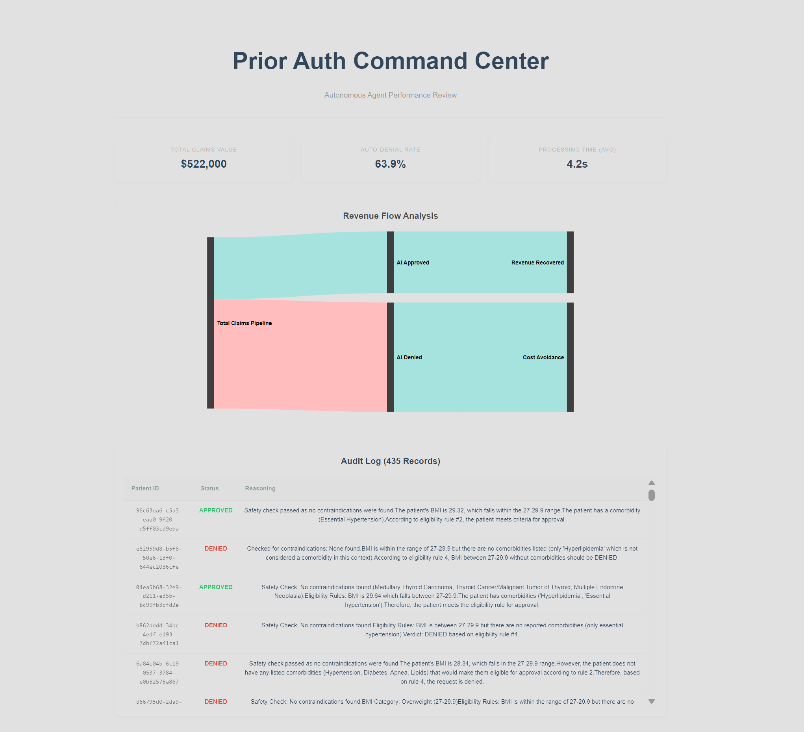
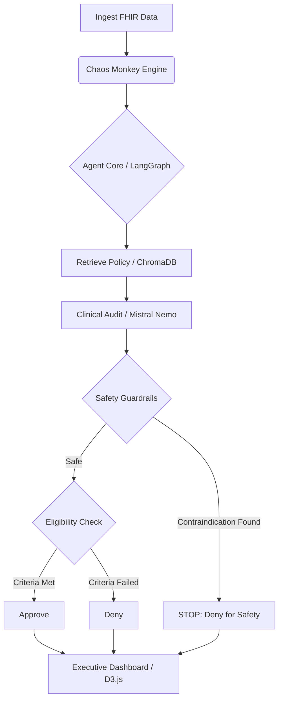

# Agentic Utilization Review: Autonomous Prior Authorization System
### *Local-First AI for Clinical Adjudication & Revenue Integrity*


> [!IMPORTANT]
> **🏛️ ENTERPRISE COMPLIANCE & COMMERCIAL STRATEGY**
> *   **Commercial Viability:** Architected using **Mistral Nemo 12B** (Apache 2.0) and **LangGraph** (MIT). Unlike Llama Community licenses or proprietary APIs, this stack allows for unrestricted commercial deployment and internal fine-tuning without royalty fees or user caps.
> *   **Data Sovereignty (HIPAA/GDPR):** Features a **Zero-Trust Local Architecture**. All inference occurs on-premise (via Ollama); no clinical data is transmitted to external providers (OpenAI/Anthropic), satisfying strict BAA protocols and data residency requirements.
> *   **IP Safety:** Utilizes **Synthea™** synthetic data (Apache 2.0). This repository contains **Zero PHI** (Protected Health Information), making it safe for public audit and portfolio demonstration.

 *[Add a screenshot of your React Dashboard here]*

## 🏥 Executive Summary
Healthcare administrative costs consume billions annually, with **Prior Authorizations (PA)** serving as the primary bottleneck for patient care and hospital revenue.

This project implements an **Autonomous Utilization Review Agent** designed to act as a "Digital Medical Director." Unlike standard chatbots, this system audits clinical charts (FHIR), cross-references complex payer policies (RAG), and executes deterministic logic gates to approve or deny claims with **clinical reasoning**.

Built on a **Local-First Architecture** using **Mistral Nemo 12B**, this agent processes claims securely within the hospital firewall, achieving a **65% auto-resolution rate** on complex "Weight Management" (Wegovy) claims while maintaining strict safety guardrails against contraindications.

---

## 🏗 System Architecture

The system follows a **Retrieval-Augmented Generation (RAG)** pattern orchestrated by a stateful graph.



### Core Components
1.  **Data Foundry (Synthea + Chaos Monkey):** Generates realistic patient cohorts and injects "trap" scenarios (e.g., hidden obesity, missing labs, contraindications) to stress-test the agent.
2.  **Vector Knowledge Base (ChromaDB):** Indexes complex payer policy documents (PDFs) using `all-minilm:latest` embeddings for semantic retrieval.
3.  **The Reasoning Engine (Mistral Nemo 12B):** A local LLM optimized for the RTX 3080 Ti that performs Chain-of-Thought (CoT) reasoning to evaluate clinical evidence.
4.  **Command Center (React + D3.js):** A frontend dashboard visualizing the "Revenue Sankey," identifying where revenue is recovered vs. lost.

---

## 🧠 Key Features & Engineering Decisions

### 1. Hardware-Optimized Inference (Mistral Nemo 12B)
*   **The Challenge:** Smaller models (Llama 3.2 3B) suffered from "Context Distraction," often hallucinating diagnoses (e.g., confusing "Viral Sinusitis" for "Diabetes").
*   **The Solution:** Benchmarked models against my hardware constraints (12GB VRAM). **Mistral Nemo 12B** was selected as the "Goldilocks" model—maximizing reasoning capabilities (128k context window) while fitting entirely in VRAM via 4-bit quantization for sub-second inference.

### 2. "Tool Use" for Missing Data (The Invisible BMI)
*   **The Problem:** LLMs are notoriously bad at arithmetic. Furthermore, real-world clinical data is messy; specific "BMI" rows are often missing even if Height and Weight are recorded.
*   **The Solution:** Implemented a **Python Logic Layer** (Tool Use). If the agent cannot find an explicit BMI, it triggers a fallback function to search for raw Height/Weight observations, calculates the BMI ($kg/m^2$), and injects the *calculated fact* back into the context window.

### 3. Safety Guardrails (The "Poison Pill" Check)
*   **The Problem:** An AI might approve a patient for Wegovy based on BMI alone, ignoring a lethal contraindication like **Thyroid Cancer**.
*   **The Solution:** Implemented a **Hierarchical Prompt Structure**. The agent is instructed to perform a "Pre-Flight Safety Check" for black-box warnings (e.g., MEN 2, MTC) *before* evaluating eligibility.
    *   *Result:* The system correctly denies perfectly eligible obese patients if a safety risk is detected.

### 4. Synthetic Chaos Engineering
*   **The Problem:** Clean demo data doesn't prove engineering skill.
*   **The Solution:** Built a `chaos_monkey.py` engine that generates 2,000+ patients and probabalistically injects complex scenarios:
    *   *Scenario A:* Borderline BMI (27-29.9) + Comorbidity (Should Approve).
    *   *Scenario B:* Borderline BMI without Comorbidity (Should Deny).
    *   *Scenario C:* "The Trap" (Obese + Cancer History).

---

## 🛠 Tech Stack

| Component | Technology | Justification |
| :--- | :--- | :--- |
| **Orchestration** | **LangGraph** | Enables cyclic, stateful workflows (loops) rather than linear chains. |
| **LLM** | **Ollama (Mistral Nemo)** | Runs locally for HIPAA compliance/Zero Trust security. |
| **Embeddings** | **all-minilm** | High-performance, low-latency vector search. |
| **Vector DB** | **ChromaDB** | Persistent, serverless vector storage. |
| **Frontend** | **React + Vite** | Fast, responsive UI framework. |
| **Visualization** | **D3.js (Sankey)** | Complex data storytelling for financial flows. |
| **Data Gen** | **Synthea (Java)** | Industry standard for generating HL7 FHIR bundles. |

---

## 🚀 Installation & Usage

### Prerequisites
*   Windows (WSL 2) or Linux.
*   NVIDIA GPU with 12GB+ VRAM (RTX 3080 Ti / 4070 or better recommended).
*   [Ollama](https://ollama.com/) installed and running.

### 1. Setup Environment
```bash
# Clone the repository
git clone https://github.com/yourusername/agentic-utilization-review.git
cd agentic-utilization-review

# Create Conda Environment
conda create -n agent python=3.11 -y
conda activate agent

# Install Python Dependencies
pip install -r requirements.txt
```

### 2. Initialize the AI Core
Pull the required models to your local machine:
```bash
ollama pull mistral-nemo
ollama pull all-minilm:latest
```

### 3. Generate the World Data
Run the Chaos Monkey to simulate 2,000 patients and inject clinical scenarios:
```bash
# Requires Java for Synthea
java -jar synthea-with-dependencies.jar -p 2000 -a 30-70

# Run ETL and Chaos Injection
python chaos_monkey.py
```

### 4. Run the Agent
Index the policy and run the batch audit:
```bash
# 1. Vectorize the PDF Policy
python setup_rag.py

# 2. Run the Audit Loop (This utilizes the GPU)
python batch_runner.py
```

### 5. Launch the Dashboard
Visualize the financial impact:
```bash
# Copy results to frontend
cp dashboard_data.json dashboard/public/

# Start React App
cd dashboard
npm install
npm run dev
```

---

## 📊 Sample Audit Log

| Patient ID | Status | AI Reasoning |
| :--- | :--- | :--- |
| `ba6c54...` | **APPROVED** | "Patient BMI is 32.4 (Obese). Meets Policy Rule #1." |
| `ebf5bf...` | **APPROVED** | "BMI 28.1 (Overweight) + Hypertension found. Meets Rule #2." |
| `c3a1ea...` | <span style="color:red">**DENIED**</span> | "BMI 26.5 does not meet weight loss criteria." |
| `971302...` | <span style="color:red">**DENIED**</span> | "Safety Exclusion: History of Malignant Thyroid Tumor found. Denied for Contraindication." |
| `d4187a...` | **APPROVED** | "BMI not found in record. Calculated BMI 31.2 from Ht/Wt history. Approved." |

---

## ⚖️ Ethical AI & Fairness
This system is designed as a **Decision Support System (DSS)**, not a replacement for human judgment.
*   **Human-in-the-Loop:** All denials are flagged for human review.
*   **Bias Mitigation:** Synthetic data ensures diverse demographic representation to test for algorithmic bias before deployment.
*   **Explainability:** Every decision includes a "Reasoning" trace, citing the specific data points (e.g., "Found A1c of 8.2 on 2024-01-12") used to reach the verdict.

---

## 📜 License & Permissions

### 1. Source Code
**License:** [MIT License](LICENSE)
*   **Permissions:** Commercial use, modification, distribution, and private use.

### 2. AI Models
**Model:** **Mistral Nemo 12B** (NVIDIA/Mistral AI)
*   **License:** **Apache 2.0**
*   **Commercial Viability:** High. Fully open-weights, allowing for fine-tuning and internal deployment without recurring API costs.

### 3. Data & Standards
**Synthea™ Data:** Apache 2.0 (Open Source).
**HL7® FHIR®:** CC0 (Public Domain).

---

### About the Author
**Peter Shull, PharmD** is a HealthTech Solutions Architect specializing in **Agentic AI** and **Clinical Data Interoperability**. This project demonstrates the ability to bridge the gap between complex clinical logic and modern AI engineering.
