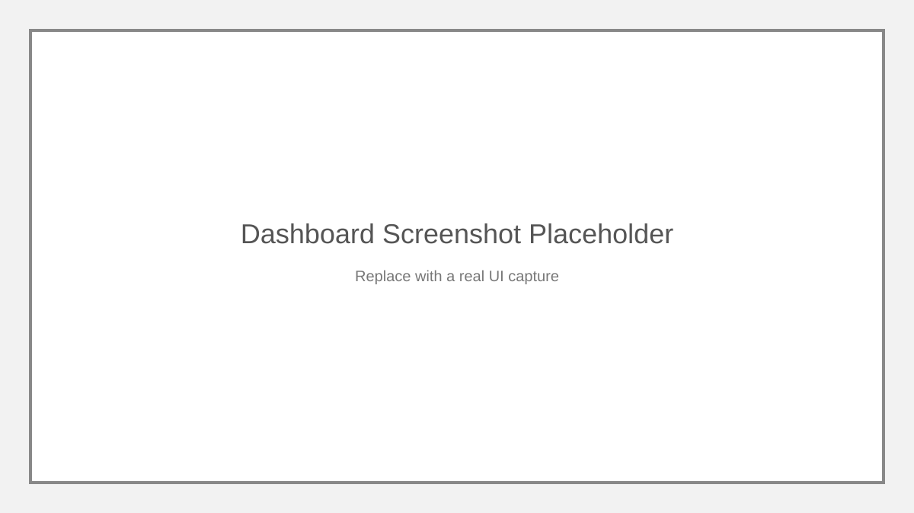
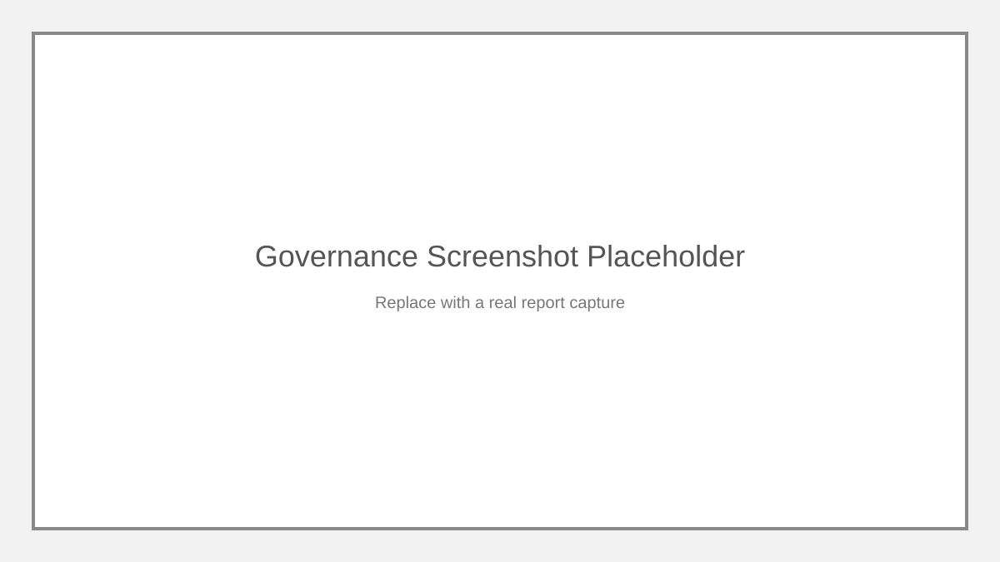
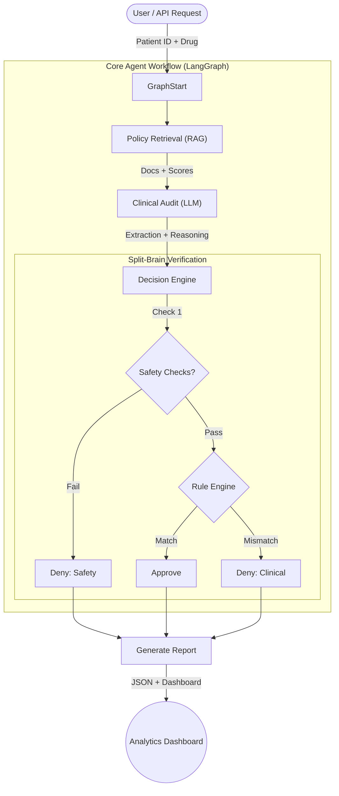

# 🏥 Autonomous Clinical Prior Authorization Agent (AI-Pa)

> **"A Deterministic-Guardrailed AI Architect for High-Stakes Clinical Decision Making."**

[](LICENSE)
[](docs/THIRD_PARTY_LICENSES.md)
[](docs/THIRD_PARTY_LICENSES.md)
[](docs/THIRD_PARTY_LICENSES.md)
[](docs/THIRD_PARTY_LICENSES.md)
[](docs/SECURITY.md)
[](docs/ARCHITECTURE.md)
[](https://github.com/shullp05/Autonomous-Prior-Auth-System/actions/workflows/tests.yml)

[](docs/THIRD_PARTY_LICENSES.md)
[](docs/THIRD_PARTY_LICENSES.md)
[](docs/THIRD_PARTY_LICENSES.md)
[](docs/THIRD_PARTY_LICENSES.md)
[](docs/THIRD_PARTY_LICENSES.md)
[](docs/THIRD_PARTY_LICENSES.md)
[](docs/THIRD_PARTY_LICENSES.md)
[](docs/THIRD_PARTY_LICENSES.md)


---

## 🚀 Executive Summary

The **Autonomous Clinical Prior Authorization Agent (AI-Pa)** automates the high-liability process of medical prior authorization for Wegovy (semaglutide) weight management prescriptions.

Unlike standard chatbots, AI-Pa uses a **Split-Brain Architecture** where the **deterministic policy engine** is the source of truth and the LLM is constrained to evidence-grounded narrative and extraction.

AI-Pa ingests patient data (CSV/FHIR), retrieves policy guidelines via **RAG**, and executes a multi-step audit to render a verdict (Approve/Deny) with evidence trails and appeal generation. The default inference path is local-only (Ollama), and offline mode can block outbound egress while still permitting localhost calls. The repo ships synthetic data only; no PHI is included.

---

## Media (placeholders)




Video placeholders:
- [End-to-end demo clip (placeholder)](docs/media/demo-clip.mp4)
- [Short demo clip (placeholder)](docs/media/demo-clip-short.mp4)

---

## 🛠️ Architecture & Workflow

The system utilizes a **Stateful Graph Workflow (LangGraph)** to orchestrate the decision process, ensuring auditability and retrievability at every step.

### Workflow Diagram


```mermaid
graph TD
    User([User / API Request]) -->|Patient ID + Drug| GraphStart

    subgraph Core["Core Agent Workflow (LangGraph)"]
        GraphStart --> NodeRetrieval["Policy Retrieval (RAG)"]
        NodeRetrieval -->|Docs + Scores| NodeAudit["Clinical Audit (LLM)"]
        NodeAudit -->|Extraction + Reasoning| NodeDecision["Decision Engine"]

        subgraph Verify["Split-Brain Verification"]
            NodeDecision -->|Check 1| Guardrails{Safety Checks?}
            Guardrails -->|Fail| VerdictDenySafety["Deny: Safety"]
            Guardrails -->|Pass| DeterministicLogic{Rule Engine}
            DeterministicLogic -->|Match| VerdictApprove["Approve"]
            DeterministicLogic -->|Mismatch| VerdictDenyClinical["Deny: Clinical"]
        end
    end

    VerdictApprove --> OutputGen["Generate Report"]
    VerdictDenySafety --> OutputGen
    VerdictDenyClinical --> OutputGen

    OutputGen -->|JSON + Dashboard| Dashboard((Analytics Dashboard))
```

### Data Flow
1.  **Ingestion**: Patient observations (BMI, Conditions, Meds) are loaded from CSV/FHIR.
2.  **Retrieval**: ChromaDB retrieves policy atoms via MedEmbed embeddings (k=25 by default), with optional BCE reranking; the top 8 docs feed the LLM by default.
3.  **Audit**: A local LLM (default flavor `nemo8b`, override via `PA_AUDIT_MODEL_FLAVOR`) analyzes clinical data against retrieved policy evidence.
4.  **Governance**: A deterministic Python layer ([src/priorauth/policy_engine.py](src/priorauth/policy_engine.py)) cross-verifies the LLM's findings against safety and eligibility rules.
5.  **Output**: Structured JSON decisions plus optional appeal letter artifacts.

---

## 🔬 Technical Deep Dive

### Core Stack
*   **Language**: Python 3.11+
*   **Orchestration**: LangGraph, LangChain
*   **Vector Query**: ChromaDB, BCEmbedding (Reranker)
*   **LLM Serving**: Ollama (Local) - Default: `pa-audit-nemotron-cascade8b:latest` via `PA_AUDIT_MODEL_FLAVOR=nemo8b` (custom Modelfile; raw models available via `PA_USE_RAW_MODELS=true`)
*   **Validation**: Pydantic (Strict Schema Enforcement)
*   **Testing**: Pytest (unit, integration, adversarial, and safety tests)

### Key Features
*   **🛡️ Deterministic Guardrails**: Prevents the "black box" problem. Safety exclusions (e.g., Pregnancy, MTC, concurrent GLP-1) are hard-coded checks that override any AI hallucination.
*   **📚 Dynamic Policy Parsing**: Automatically parses policy guidelines into structured JSON snapshots ([policies/RX-WEG-2025.json](policies/RX-WEG-2025.json)) with SHA-256 hashing for version control.
*   **📉 RAG with Reranking**: Two-stage retrieval (Vector Search → Cross-Encoder Reranking) ensures the AI sees only the most relevant policy clauses.
*   **⚖️ Governance Audit**: FNR (False Negative Rate) parity analysis using Wilson CI and two-proportion z-tests to detect bias across demographic groups.

### Multi-Layer Safety Model

| Layer | Component | Description |
|-------|-----------|-------------|
| 1 | LLM Output | Pydantic `AuditResult` schema validation |
| 2 | JSON Parsing | Robust `_extract_json_object()` with fallbacks |
| 3 | Python Guardrails | `_apply_policy_guardrails()` enforces hard rules |
| 4 | Deterministic Override | `evaluate_eligibility()` always runs as cross-check |
| 5 | Governance Audit | `run_governance_audit()` for FNR parity |

---

## 📊 Dashboard Metrics & Definitions

The analytics dashboard provides real-time visibility into the prior authorization process. All metrics are computed deterministically using the **Metrics Contract** ([apps/ui/src/metricsEngine.js](apps/ui/src/metricsEngine.js)).

### Status Taxonomy
| Display Label | Definition | Action Required |
|:---|:---|:---|
| **Meets Criteria** | Clinical data fully satisfies policy requirements (Clinical + Admin). | None (Auto-Approved) |
| **Needs Clarification** | Ambiguous terms found (e.g., "elevated BP"). | **Manual Review** |
| **Missing Required Data** | Essential observation data absent. | **Provider Outreach** |
| **CDI Required** | Clinical eligibility met, but missing strictly enforced anchor codes (e.g., E66.x). | **Physician Query** |
| **Safety Signal** | Historical or potential safety risk detected; requires human confirmation. | **Safety Verification** |
| **Safety Contraindication** | Active "Hard Stop" detected (e.g., Pregnancy). | None (Auto-Denied) |
| **Not Eligible** | Clinical data explicitly violates policy criteria. | None (Auto-Denied) |

### Key Performance Indicators (KPIs)

*   **Revenue Secured**: Total value of all `APPROVED` cases.
*   **Revenue at Risk**: Total value of `CDI_REQUIRED` cases (recoverable with administrative fix).
*   **Cost Avoidance**: Total value of all `DENIED` cases.
*   **Needs Review**: Count of manual touchpoints required (`Clarification` + `Missing Data` + `Safety Signal` + `CDI`).

### Hours Saved Calculation
Distinctly separates "System Processing Velocity" from "Staff Governance Assumptions".

*   **Processing Velocity (System)**: Use `python -m priorauth.apps.agent.benchmark` to measure on your dataset (see [reports/benchmark.txt](reports/benchmark.txt) for the latest local run).
*   **Staff Hours Saved (Governance)**:
    *   **Formula**: `Auto-Resolved Cases × Governance Constant`
    *   **Assumption**: Define per-organization (e.g., minutes per complex PA review).
    *   **Basis**: Purely an ROI input, unrelated to compute speed.

---

## 🔒 Credibility Hardening
Security and trust are architectural first principles, not afterthoughts.

### 1. Offline Enforcement & Reproducibility
*   **Offline Enforcement**: Runtime patching of `socket`, `getaddrinfo`, `urllib`, and `requests` blocks outbound egress while allowing localhost (Ollama).
    *   Enabled via `PA_OFFLINE_MODE=true` (opt-in).
    *   Raises standard network exceptions when blocked; loopback aliases remain allowed by default.
*   **Offline Env Guardrails**: `HF_HUB_OFFLINE=1`, `HF_HUB_DISABLE_TELEMETRY=1`, `TRANSFORMERS_OFFLINE=1`, `LANGSMITH_DISABLED=true`, and `ANONYMIZED_TELEMETRY=false` are set in offline runtime scripts and docker compose.
*   **Dependency Locking**: [requirements.lock](requirements.lock) generated via [scripts/freeze_dependencies.sh](scripts/freeze_dependencies.sh).

### 2. Tamper-Evident Audit
*   **Cryptographic Chaining**: All decisions are logged to [output/audit_log.jsonl](output/audit_log.jsonl) using SHA-256 hash chaining (runtime artifact; gitignored). Format example: [docs/examples/audit_log.sample.jsonl](docs/examples/audit_log.sample.jsonl).
*   **Verification**: A standalone script ([verify_audit.py](verify_audit.py)) detects any modification, deletion, or reordering of the log history.
*   **Centralized Logging**: [src/priorauth/audit_logger.py](src/priorauth/audit_logger.py) singleton captures every automated decision (input + output).

### 3. Coding Integrity Overlay (CDI)
*   **Clinical ≠ Administrative**: A patient can be clinically eligible (BMI 35) but administratively incomplete (Missing ICD-10 E66.9).
*   **Automated Physician Query**: The system detects this gap and generates specific query language to resolve the coding deficiency without a clinical denial.

---

## 📂 Project Structure

- [src/priorauth/](src/priorauth/) — 🧠 core package (key modules: [src/priorauth/agent_logic.py](src/priorauth/agent_logic.py), [src/priorauth/policy_engine.py](src/priorauth/policy_engine.py), [src/priorauth/governance_audit.py](src/priorauth/governance_audit.py), [src/priorauth/apps/](src/priorauth/apps/))
- [apps/ui/](apps/ui/) — 📊 React/Vite analytics dashboard (metrics: [apps/ui/src/metricsEngine.js](apps/ui/src/metricsEngine.js))
- [docker/](docker/) — 🐳 container tooling ([docker/Dockerfile](docker/Dockerfile), [docker/docker-compose.blackbox.yml](docker/docker-compose.blackbox.yml))
- [docs/](docs/) — 📚 architecture, security, runbook, modeling
- [policies/](policies/) — 📂 JSON policy snapshots (example: [policies/RX-WEG-2025.json](policies/RX-WEG-2025.json))
- [tests/](tests/) — 🧪 pytest suite (unit + safety coverage)
- [output/](output/) — 📊 runtime artifacts (example: [output/audit_log.jsonl](output/audit_log.jsonl); format: [docs/examples/audit_log.sample.jsonl](docs/examples/audit_log.sample.jsonl))

---

## 🚦 Getting Started

### Prerequisites
*   Python 3.11+
*   Conda/Micromamba (recommended: `revenue_agent` environment)
*   [Ollama](https://ollama.ai/) (for local LLM inference)

### Installation
1.  **Clone the repository**
    ```bash
    git clone https://github.com/your-username/autonomous-prior-auth.git
    cd autonomous-prior-auth
    ```

2.  **Install Dependencies**
    ```bash
    pip install -r requirements.lock
    # or: pip install -r requirements.txt (dev installs)
    ```
    Inputs: [requirements.lock](requirements.lock), [requirements.txt](requirements.txt).

### Offline Artifacts (optional)
Build wheelhouse + model staging (online build step):
```bash
scripts/build_artifacts_linux.sh requirements.lock
# Windows:
# powershell -ExecutionPolicy Bypass -File scripts/build_artifacts_windows.ps1 -RequirementsFile requirements.lock
```
Scripts: [scripts/build_artifacts_linux.sh](scripts/build_artifacts_linux.sh), [scripts/build_artifacts_windows.ps1](scripts/build_artifacts_windows.ps1). Input: [requirements.lock](requirements.lock).

Install from wheelhouse only (offline runtime):
```bash
scripts/install_offline_linux.sh requirements.lock
# Windows:
# powershell -ExecutionPolicy Bypass -File scripts/install_offline_windows.ps1 -RequirementsFile requirements.lock
```
Scripts: [scripts/install_offline_linux.sh](scripts/install_offline_linux.sh), [scripts/install_offline_windows.ps1](scripts/install_offline_windows.ps1). Input: [requirements.lock](requirements.lock).
This follows a **build-time online / run-time offline** split: download wheels/models once, then install with `--no-index --find-links` only.

### Docker (CPU default)
```bash
docker build -f docker/Dockerfile --build-arg REQUIREMENTS_FILE=requirements-docker-cpu.txt -t priorauth:local .
docker run --rm priorauth:local pytest -q
```
Files: [docker/Dockerfile](docker/Dockerfile), [requirements-docker-cpu.txt](requirements-docker-cpu.txt).

### Docker (CUDA build)
```bash
docker build -f docker/Dockerfile --build-arg REQUIREMENTS_FILE=requirements.txt -t priorauth:cuda .
docker run --rm priorauth:cuda pytest -q
```
Files: [docker/Dockerfile](docker/Dockerfile), [requirements.txt](requirements.txt).
CUDA builds download large NVIDIA CUDA wheels and require a compatible NVIDIA runtime.

### Docker (Black-box offline, no network)
```bash
docker compose -f docker/docker-compose.blackbox.yml up --build
```
Compose: [docker/docker-compose.blackbox.yml](docker/docker-compose.blackbox.yml).
This deployment runs the agent with `network_mode: "none"` and read-only `/models` mounts.

3.  **Setup Environment**
    Create an environment file (or rely on defaults in [src/priorauth/config.py](src/priorauth/config.py)):
    ```ini
    PA_AUDIT_MODEL_FLAVOR=nemo8b
    PA_EMBED_MODEL=kronos483/MedEmbed-large-v0.1:latest
    ```

### Execution
**Run a Batch Simulation:**
```bash
# 1. Generate Synthetic Data
python -m priorauth.apps.agent.chaos_monkey

# 2. Setup Vector Store
python -m priorauth.apps.agent.setup_rag

# 3. Run the Agent
python -m priorauth.apps.agent.batch_runner
```

**Runtime Modes (Letters + Offline):**
```bash
# Deterministic letters (default, zero LLM calls)
PA_LETTER_MODE=deterministic python -m priorauth.apps.agent.batch_runner

# Ollama letters (requires local Ollama/model)
PA_LETTER_MODE=ollama python -m priorauth.apps.agent.batch_runner

# Optional: allow explicit fallback if Ollama is unavailable
PA_ALLOW_LETTER_FALLBACK=1 PA_LETTER_MODE=ollama python -m priorauth.apps.agent.batch_runner

# Offline deterministic (no sockets allowed)
scripts/run_offline_deterministic.sh

# Offline Ollama (loopback allowed, external blocked)
scripts/run_offline_ollama.sh
```
Scripts: [scripts/run_offline_deterministic.sh](scripts/run_offline_deterministic.sh), [scripts/run_offline_ollama.sh](scripts/run_offline_ollama.sh).

Offline enforcement note: **offline ≠ no sockets allowed**. Offline mode blocks external egress while
optionally allowing loopback for local Ollama; set `PA_OFFLINE_ALLOW_LOCALHOST=false` to block all sockets.
CI/sandbox note: if your environment blocks all sockets, `PA_LETTER_MODE=ollama` will surface `LLM_UNAVAILABLE`;
use deterministic mode or run Ollama locally with loopback allowed.

**Run Verification Tests:**
```bash
pytest -q
```

---

## 🧪 Test Coverage

The test suite includes:
- **Adversarial Tests**: Edge cases, boundary conditions, ambiguous terms
- **Safety Tests**: Zero false approvals for MTC, pregnancy, concurrent GLP-1
- **Policy Integration**: Comorbidity detection, BMI thresholds
- **Statistical Tests**: Wilson CI, two-proportion z-test edge cases
- **JSON Extraction**: Robust parsing from LLM output

```bash
# Run all tests
pytest -q
```

Local evidence from this repo run: [reports/pytest.txt](reports/pytest.txt).

---

*Engineered with precision. Designed for trust.*
